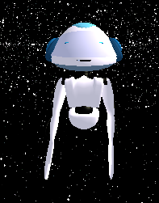
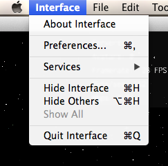
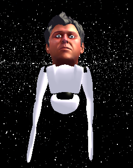
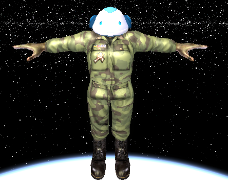
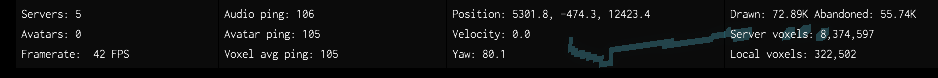
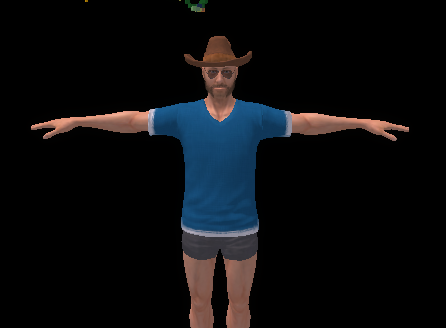
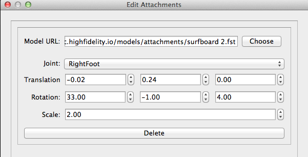
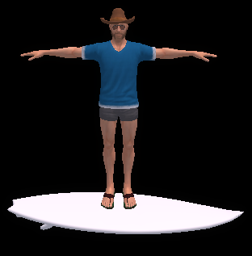

# Introducing MyAvatar

You've downloaded and built the High Fidelity Interface and your Oculus Rift is on pre-order. Now what? Might as well get to know your alter-ego, MyAvatar. 

Upon running the Interface, you'll be presented with your brand-new digital body: 

Although adorable, this little guy has no legs, eliminating your ability to use many of the example scripts provided by High Fidelity. Let's customize the avatar to be a not only a bit more functional, but also bit more personalized. 

## Body and Head

Open up the Preferences menu via the Interface menu:

You'll see the options to set your avatar's head and body. 

Play around with the dropdowns by for the head and body to customize your avatar. 

For example, this is the default avatar with the `ChrisStylized_6.fst` head:

Using the same menu, try to find a body and head that match:

## Moving Around

If you're having trouble moving around using the keyboard, ("w"/"s"" for +/- x, "e"/"c" for +/- y, "a"/"d" for +/ yaw), turn on the "Stats" view by pressing "SHIFT + %" and get some real-time feedback on your location, yaw, velocity, and more:

## Attachments

There's more to life than the body you want. The next step is to acquire the possesions. 

Let's say you are ready to start your virtual life as a cowboy surfer. You've picked out your body:

But you are no poser! Grab a board by opening the Attachments menu via the Edit dropdown, and configure it to look like the menu below:

Voila! Your are now surfing the world wide web in style. 

## Explore!

Surfboard in hand (or at feet), use the keyboard and arrow keys to explore and build. 

