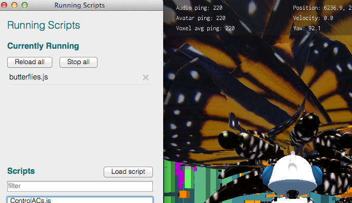
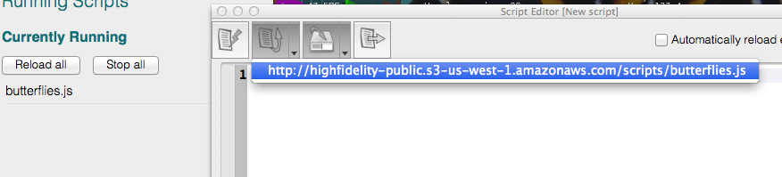
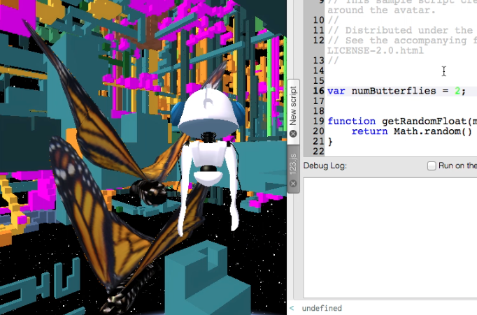

# Exploring the Script Editor with Butterfly.js

## Running `butterfly.js`

### Load the Script

The `butterfly.js` script gives your avatar a kaleidoscope of butterflies to keep it company. 

Take a look by restarting the Interface and running the `butterfly.js` script via `File/Running Scripts`



### View the Script

The butterflies are pretty and seem to follow the avatar, but there are too many of them to be able to study their behavior in detail. In order to view the script and get a better idea of what is going on:

- Open the script editor via `Tools/Script Editor...`
- Find the script by clicking the down-pointing triangle on the second button from the left
- Load the script by selecting the `...butterfly.js` URL from the dropdown



Run the script by hitting `F5` on your keyboard or clicking on the rightmost button. This action should prompt you to save the script locally, so pick a memorable name and hit save. 

Now you will have twice as many butterflies swarming around your avatar. Stop both scripts via their respective menus - hitting 'stop all' in the 'Running Scripts' menu and the rightmost button in the 'Script Editor'. 

For the purposes of this article, you'll be running and stopping the butterfly script from the script editor. Make sure 'Run on the fly' is unchecked, as this script can cause the Interface to crash. 

## Edit `butterfly.js`

### From a kaleidoscope to a couple

First, let's try to get to a manageable number of butterflies, like two. Set the `numButterflies` to `2`.

```
...

// Distributed under the Apache License, Version 2.0.
// See the accompanying file LICENSE or http://www.apache.org/licenses/LICENSE-2.0.html
//

var numButterflies = 2; //a more manageable number

function getRandomFloat(min, max) {
    return Math.random() * (max - min) + min;
}

...
```
Re-run the script and verify that there are now two butterflies.



### Help the butterflies keep up

Try moving around a bit and try to verify that the butterflies are following you. You'll notice that since the butterflies are moving around at a snail's pace, it's a bit hard to tell if they're actually in tow. 

Stop the running script. Around line 50, update BUTTERFLY_VELOCITY to something closer to your habitual velocity, which you can check by opening the Stats view under "View", then restart the script. 


```
var BUTTERFLY_GRAVITY = 0;//-0.06;
var BUTTERFLY_FLAP_SPEED = 1.0;
var BUTTERFLY_VELOCITY = 20; /*butterflies should be zooming around with you now!*/
var DISTANCE_IN_FRONT_OF_ME = 1.0;
var DISTANCE_ABOVE_ME = 1.0;
```
Now you can zoom around with your butterflies right at your heels. 

## Reload the Modified `butterfly.js`

After some time you will be butterfly-less. They have a limited lifespan and may have died out naturally. Perhaps you wanted to have some time by yourself and ended their script. 

Either way, you're probably far from your initial location and would like to once again experience butterflies. 

### Run and Editing your Local Script

If you want to run but not edit your edited file, select your saved script via `File\Open and Run script File...`, and two butterflies should appear around you. 

If you would like to edit your file before running it, open the Script Editor, click the second button from the left. Your script should appear in the editor after selecting it from the explorer/finder.

## The Debug Log

Logs are an indispensable part of any scripting. You might have noticed that the script editor's Debug log was pretty empty while running `butterfly.js`. 

Let's change that by adding the a command to print towards the end of the function `addButterfly()`:

```
function addButterfly() {

...

    properties.position.z = properties.position.z+1;
    butterflies.push(new defineButterfly(Entities.addEntity(properties), properties.position));
	print("Butterfly added!");
}

...

```
Run the script, and notice the debug log now says:

```
> Butterfly added!
> Butterfly added!
```

Your avatar should now have the same number of butterflies around is as `Butterfly added!` statements in the log. 

For testing purposes, it would be nice to know the coordinates of the butterflies as they appear. 

Directly above the print statement is a promising line:

`butterflies.push(new defineButterfly(Entities.addEntity(properties), properties.position));`

`properties.position` seems to be the position of the new butterfly entity. 

Let's try adding `properties.position` to the print statement:

```
print("Butterfly added at: " + properties.position);
```

Take a look at the output:

```
> Butterfly added at: [object Object]
> Butterfly added at: [object Object]
```

This isn't very human-readable. Let's JSON.stringify it:

```
print("Butterfly added at: " + JSON.stringify(properties.position));
```

The output looks a bit nicer now:

```
> Butterfly added at: {"x":6227.20556640625,"y":222.0852508544922,"z":3986.543701171875}
> Butterfly added at: {"x":6228.36962890625,"y":222.44215393066406,"z":3987.716064453125}
```

You can make the output a bit more readable by adding something like the following to your version of `butterfly.js`:

```
function readable(item){
	var output = '', val; //initialize as string
	for (val in item)
	if (object.hasOwnProperty(val)){
	output += "\n" + val +": " + (item[val]);
	}
	return output;
}

```

... for which the output of 

```
	print("Butterfly added at: " + readable(properties.position));
```

would be something like:

```
> Butterfly added at: 
x: 6270.43212890625
y: 210.25216674804688
z: 5996.404296875
> Butterfly added at: 
x: 6270.5888671875
y: 211.6746368408203
z: 5996.43994140625
```
## Have Fun!