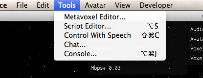
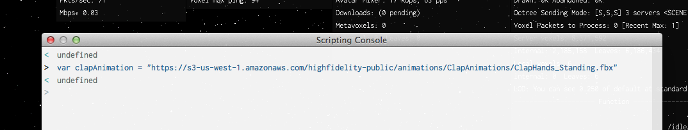
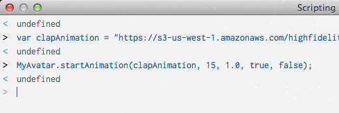
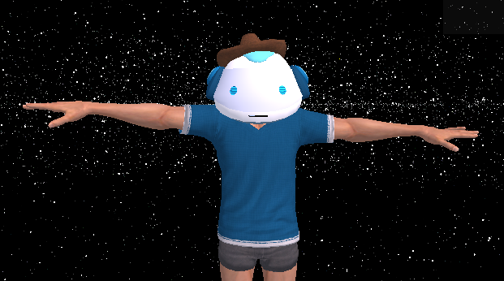
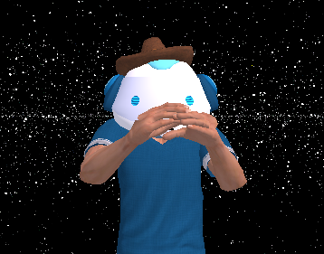
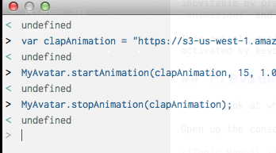
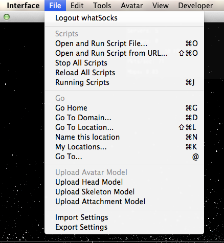
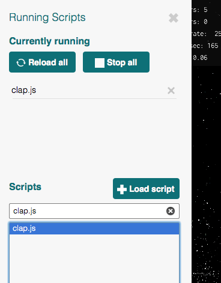
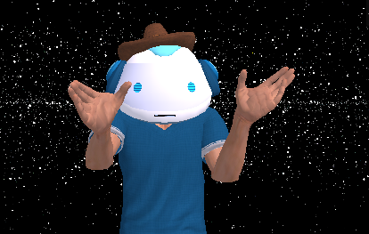

# Customizing your Avatar with JavaScript

## Teach your Avatar to Clap

## Introduction

Assuming you've been able to download and set up your High Fidelity interface and pick out a nice skeleton for your Avatar, you might wonder - is there anything more to virtual life than creating voxels and flying around? What if your Avatar's nose itches? How would it scratch? 

Although thankfully itchiness has not yet been implemented, you can get ready for the inevitable by practicing manipulating your Avatars' arms and hands via high fidelity `animations` and keyboard inputs. 

This article explores the `clap.js` script, a script that loads a pre-built clapping animation activated by keyboard inputs.  

## Preview

Take a look at what you're getting into. 

Open up the JavaScript console via the "Console..." option in the Tools menu. 

Loading the .fbx file that describes clapping:

`var clapAnimation = "https://s3-us-west-1.amazonaws.com/highfidelity-public/animations/ClapAnimations/ClapHands_Standing.fbx";`

Start the animation by sending the following command:

`MyAvatar.startAnimation(clapAnimation, 15, 1.0, true, false);`

See the difference! 

### Before

### After

Give the Avatar a break by stopping the animation:

`MyAvatar.stopAnimation(clapAnimation);`

## Running Boilerplate `clap.js`

Naturally, nobody wants to depend on the console to clap (or activate other carefully prepared movements). You can load and run the `clap.js` script to clap whenever you want. 

Open the script selector via the "Running Scripts" option under the File menu:

Search for `clap.js` in the "Running Scripts" menu. Load the script by double-clicking the desired script:

Pound the shift key repeatedly! Your Avatar should be clapping now. 

## Making Some Changes

High Fidelity offers users nearly unlimited flexibility in uploading and modifying Avatar scripts. Although the clapping script in the High Fidelity examples folder works fine, you may want to assign a different key binding to the animation, or change the relationship between key-pounding and clap rate.

Let's explore how to make these changes. 

### Changing the Key Binding - *A small modification*

In this section, we'll replace the "SHIFT" key with the "SPACE" bar for starting and stopping the clap animation. 

First, take a look at the code responsible for assigning the "SHIFT" key the responsibility for starting and stopping the animation:


...

Controller.keyPressEvent.connect(function(event) {
	if(event.text == "SHIFT") {
		if (!clickClappingNow) {
			clickClappingNow = true;
...

var CLAP_END_WAIT_MSECS = 300;
Controller.keyReleaseEvent.connect(function(event) {
    if (event.text == "SHIFT") {
    	collectedClicks = 0;
    	if (!startedTimer) {
    		collectedClicks = 0;
    		Script.setTimeout(stopClapping, CLAP_END_WAIT_MSECS);
    		startedTimer = true;
    	}
    }
});

...



Back in the "File" menu, click on "Stop all running scripts" to ensure a clean slate. Next, open the "Script Editor" from the "Tools" menu, and paste in the `clap.js` code, included at the end of this file. 

Check "Run on the fly" and hit the "Toggle Run Script" button to save and run the file. 

Verify that the script is running by hitting the SHIFT key and verifying that the Avatar is clapping. Hit the SPACE key and note that the Avatar does not clap. 

Now, replace both instances of "SHIFT" with "SPACE" in the script:


...

Controller.keyPressEvent.connect(function(event) {
	if(event.text == "SPACE") {
		if (!clickClappingNow) {
			clickClappingNow = true;
...

var CLAP_END_WAIT_MSECS = 300;
Controller.keyReleaseEvent.connect(function(event) {
    if (event.text == "SPACE") {
    	collectedClicks = 0;
    	if (!startedTimer) {
    		collectedClicks = 0;
    		Script.setTimeout(stopClapping, CLAP_END_WAIT_MSECS);
    		startedTimer = true;
    	}
    }
});

...


Go back to the Interface and try to clap by hitting the SHIFT key. Now try to clap by hitting the SPACE key. 

## Uploading the your new script

Upon running the script in the script editor, you were prompted to save the edited script locally, probably with some default value of `script.js`.

You can upload this file via "Open and Run Script File" option on the "File" menu. 

## Appendix

For reference purposes, the script at the time of writing is included below:


//
//  clap.js
//  examples
//
//  Copyright 2014 High Fidelity, Inc.
//
//  This sample script watches your hydra hands and makes clapping sound when they come close together fast, 
//  and also watches for the 'shift' key and claps when that key is pressed.  Clapping multiple times by pressing 
//  the shift key again makes the animation and sound match your pace of clapping. 
//
//  Distributed under the Apache License, Version 2.0.
//  See the accompanying file LICENSE or http://www.apache.org/licenses/LICENSE-2.0.html
//

var clapAnimation = "https://s3-us-west-1.amazonaws.com/highfidelity-public/animations/ClapAnimations/ClapHands_Standing.fbx";
var ANIMATION_FRAMES_PER_CLAP = 10.0;
var startEndFrames = [];
startEndFrames.push({ start: 0, end: 10});
startEndFrames.push({ start: 10, end: 20});
startEndFrames.push({ start: 20, end: 30});
startEndFrames.push({ start: 30, end: 40});
startEndFrames.push({ start: 41, end: 51});
startEndFrames.push({ start: 53, end: 0});

var lastClapFrame = 0;
var lastAnimFrame = 0;

var claps = [];
claps.push(new Sound("http://highfidelity-public.s3-us-west-1.amazonaws.com/sounds/claps/BClap1Rvb.wav"));
claps.push(new Sound("http://highfidelity-public.s3-us-west-1.amazonaws.com/sounds/claps/BClap2Rvb.wav"));
claps.push(new Sound("http://highfidelity-public.s3-us-west-1.amazonaws.com/sounds/claps/BClap3Rvb.wav"));
claps.push(new Sound("http://highfidelity-public.s3-us-west-1.amazonaws.com/sounds/claps/BClap4Rvb.wav"));
claps.push(new Sound("http://highfidelity-public.s3-us-west-1.amazonaws.com/sounds/claps/BClap5Rvb.wav"));
claps.push(new Sound("http://highfidelity-public.s3-us-west-1.amazonaws.com/sounds/claps/BClap6Rvb.wav"));
claps.push(new Sound("http://highfidelity-public.s3-us-west-1.amazonaws.com/sounds/claps/BClap7Rvb.wav"));
claps.push(new Sound("http://highfidelity-public.s3-us-west-1.amazonaws.com/sounds/claps/BClap8Rvb.wav"));
claps.push(new Sound("http://highfidelity-public.s3-us-west-1.amazonaws.com/sounds/claps/BClap9Rvb.wav"));
claps.push(new Sound("http://highfidelity-public.s3-us-west-1.amazonaws.com/sounds/claps/BClap10Rvb.wav"));
var numberOfSounds = claps.length;

var clappingNow = false;
var collectedClicks = 0;

var clickStartTime, clickEndTime;
var clickClappingNow = false; 
var CLAP_START_RATE = 15.0;
var clapRate = CLAP_START_RATE; 
var startedTimer = false; 

function maybePlaySound(deltaTime) {
	//  Set the location and other info for the sound to play

	var animationDetails = MyAvatar.getAnimationDetails(clapAnimation);

	var frame = Math.floor(animationDetails.frameIndex);

	if (frame != lastAnimFrame) {
		lastAnimFrame = frame;
	}

	for (var i = 0; i < startEndFrames.length; i++) {
		if (frame == startEndFrames[i].start && (frame != lastClapFrame)) {
			playClap(1.0, Camera.getPosition());
			lastClapFrame = frame; 
		}
	}

	var palm1Position = MyAvatar.getLeftPalmPosition();
	var palm2Position = MyAvatar.getRightPalmPosition();
	var distanceBetween = Vec3.length(Vec3.subtract(palm1Position, palm2Position));

	var palm1Velocity = Controller.getSpatialControlVelocity(1);
	var palm2Velocity = Controller.getSpatialControlVelocity(3);
	var closingVelocity = Vec3.length(Vec3.subtract(palm1Velocity, palm2Velocity));

	const CLAP_SPEED = 0.7;
	const CLAP_DISTANCE = 0.15; 

	if ((closingVelocity > CLAP_SPEED) && (distanceBetween < CLAP_DISTANCE) && !clappingNow) {
		var volume = closingVelocity / 2.0;
		if (volume > 1.0) volume = 1.0;
		playClap(volume, palm1Position);
		clappingNow = true; 
	} else if (clappingNow && (distanceBetween > CLAP_DISTANCE * 1.2)) {
		clappingNow = false;
	}
}

function playClap(volume, position) {
	var options = new AudioInjectionOptions();
	options.position = position;
	options.volume = 1.0;
	var clip = Math.floor(Math.random() * numberOfSounds);
	Audio.playSound(claps[clip], options);
}

var FASTEST_CLAP_INTERVAL = 150.0;
var SLOWEST_CLAP_INTERVAL = 750.0;

Controller.keyPressEvent.connect(function(event) {
	if(event.text == "SHIFT") {
		if (!clickClappingNow) {
			clickClappingNow = true;
			clickStartTime = new Date();
			lastClapFrame = 0;
		} else {
			//  start or adjust clapping speed based on the duration between clicks
			clickEndTime = new Date();
			var milliseconds = Math.max(clickEndTime - clickStartTime, FASTEST_CLAP_INTERVAL);
			clickStartTime = new Date();
			if (milliseconds < SLOWEST_CLAP_INTERVAL) {
				clapRate = ANIMATION_FRAMES_PER_CLAP * (1000.0 / milliseconds);
				playClap(1.0, Camera.getPosition());
				MyAvatar.stopAnimation(clapAnimation);
				MyAvatar.startAnimation(clapAnimation, clapRate, 1.0, true, false);
			}
			collectedClicks = collectedClicks + 1;
		}
	}
});

var CLAP_END_WAIT_MSECS = 300;
Controller.keyReleaseEvent.connect(function(event) {
    if (event.text == "SHIFT") {
    	collectedClicks = 0;
    	if (!startedTimer) {
    		collectedClicks = 0;
    		Script.setTimeout(stopClapping, CLAP_END_WAIT_MSECS);
    		startedTimer = true;
    	}
    }
});

function stopClapping() {
	if (collectedClicks == 0) {
		startedTimer = false;
	   	MyAvatar.stopAnimation(clapAnimation);
       	clapRate = CLAP_START_RATE;
       	clickClappingNow = false;
	}  else {
		startedTimer = false;
	} 
}

// Connect a call back that happens every frame
Script.update.connect(maybePlaySound);

